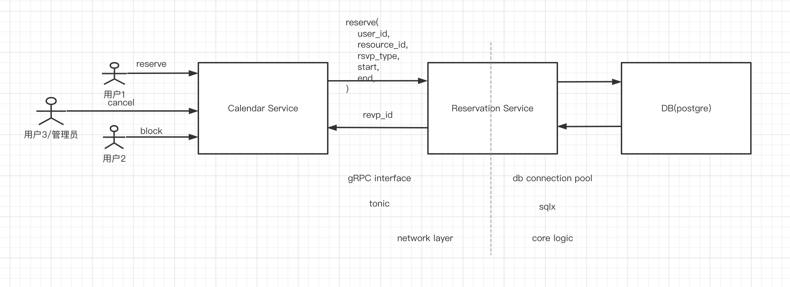
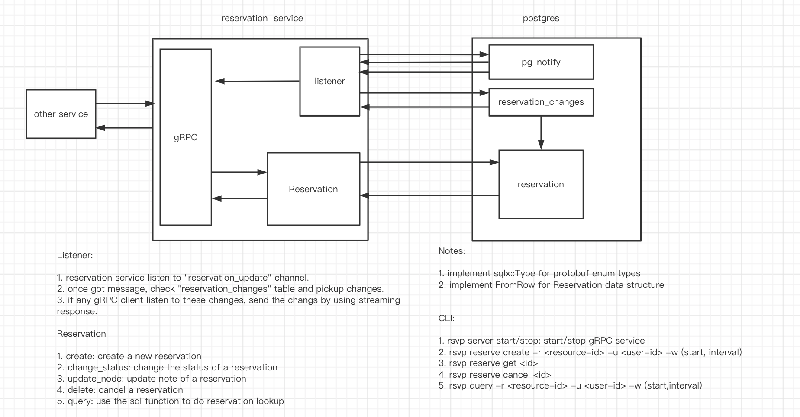

# Core Reservation Service

---

- Feature Name: core-reservation-service
- Start Date: 2022-10-23 17:37:00

## 总体规划

实现一个资源预定服务，用来解决资源预留一定时间的问题。我们利用 postgres EXCLUDE 约束来确保在给定时间只能为给定资源进行一次预定。

## 动机

Rust 练习项目。

## 实现说明

基础架构


**服务接口说明**
我们使用 gRPC 实现服务接口。下面为 proto 文件的定义：

```proto
syntax="proto3";
package reservation;

// 预约状态
enum ReservationStatus{
  RESERVATION_STATUS_UNKNOWN=0; // 未知状态
  RESERVATION_STATUS_PENDING=1; // 待确认状态
  RESERVATION_STATUS_CONFIRMED=2;// 已确认状态
  RESERVATION_STATUS_BLOCKED=3;// 锁定状态
}

enum ReservationUpdateType{
  RESERVATION_UPDATE_TYPE_UNKNOWN=0;
  RESERVATION_UPDATE_TYPE_CREATE=1;
  RESERVATION_UPDATE_TYPE_UPDATE=2;
  RESERVATION_UPDATE_TYPE_DELETE=3;
}

// 预约资源信息
message Reservation{
  string id=1;
  string user_id=2;
  ReservationStatus status=3;

  // 资源预约信息
  string resource_id=4;
  google.protobuf.Timestamp start=5;
  google.protobuf.Timestamp end=6;

  // 额外信息
  string note=7;
}

message ReserveRequest{
  Reservation reservation=1;
}

message ReserveResponse{
  Reservation reservation=1;
}

message UpdateRequest{
  string node=1;
}

message UpdateResponse{
  Reservation reservation=1;
}

message ConfirmRequest{
  string id=1;
}

message ConfirmResponse{
  Reservation reservation=1;
}

message CancelRequest{
  string id=1;
}

message CancelResponse{
  Reservation reservation=1;
}

message GetRequest{
  string id=1;
}

message GetResponse{
  Reservation reservation=1;
}

message QueryRequest{
  string resource_id=1;
  string user_id=2;
  // use status to filter result. If UNKNOWN,return all reservations
  ReservationStatus status=3;
  google.protobuf.Timestamp start=4;
  google.protobuf.Timestamp end=4;
}

message ListenRequest{}
message ListenResponse{
  ReservationUpdateType op=1;
  Reservation reservation=2;
}


service ReservationService{
  rpc reserve(ReserveRequest) returns (ReserveResponse);
  rpc confirm(ConfirmRequest) returns (ConfirmResponse);
  rpc update(UpdateRequest) returns (UpdateResponse);
  rpc cancel(CancelRequest) returns (CancelResponse);
  rpc get(GetRequest) returns (GetResponse);
  rpc query(QueryRequest) returns (stream Reservation);
  // another system could monitor newly added/confirmed/cancelled reservations
  rpc listen(ListenRequest) returns (stream ListenResponse);
}
```

**Database schema**
我们使用数据库为：postgres。

```sql
CREATE SCHEMA rsvp;
CREATE TYPE rsvp.reservation_status AS ENUM('unknown','pending','confirmed','blocked');
CREATE TYPE rsvp.reservation_update_type AS ENUM('unknown','create','update','delete');

CREATE TABLE rsvp.reservations(
  id uuid NOT NULL DEFAULT uuid_generate_v4(),
  user_id VARCHAR(64) NOT NULL,
  status rsvp.reservation_status NOT NULL DEFAULT 'pending',

  resource_id VARCHAR(64) NOT NULL,
  timespan TSTZRANGE NOT NULL,

  note TEXT,

  CONSTRAINT reservations_pkey PRIMARY KEY (id),
  CONSTRAINT reservations_conflict EXCLUDE USING gist (resource_id WITH=,timespan WITH &&)
);
CREATE INDEX reservations_resource_id_idx ON rsvp.reservations (resource_id);
CREATE INDEX reservations_user_id_idx ON rsvp.reservations (user_id);

-- if user_id is null, find all reservations within during for the resource
-- if resource_id is null, find all reservations during for the user
-- if both are null, find all reservations within during
-- if both set,find all reservations within during for the resource and user
CREATE OR REPLACE FUNCTION rsvp.query(uid text,rid text,during TSTZRANGE) RETURNS TABLE rsvp.reservations AS $$ $$ LANGUAGE plpgsql;

-- reservation change queue
CREATE TABLE rsvp.reservation_changes(
  id SERIAL NOT NULL,
  reservation_id uuid NOT NULL,
  op rsvp.reservation_update_type NOT NULL
);

-- trigger for add/update/delete a reservation
CREATE OR REPLACE FUNCTION rsvp.reservations_trigger() RETURNS TRIGGER AS $$
BEGIN
    IF TG_OP='INSERT' THEN
        -- update reservation_changes
        INSERT INTO rsvp.reservation_changes (reservation_id,op) VALUES (NEW.id, 'create');
    ELSIF TG_OP = 'update' THEN
        -- if status changed,update reservation_changes
        IF OLD.status <> NEW.status THEN
            INSERT INTO rsvp.reservation_changes (reservation_id,op) VALUES (OLD.id,'update');
        END IF;
    ELSIF TG_OP = 'DELETE' THEN
        -- update reservation_changes
        INSERT INTO rsvp.reservation_changes (reservation_id,op) VALUES (OLD.id,'delete');
    END IF;
    -- notify a channel called reservation_udate
    NOTIFY reservation_update;
    RETURN NULL;
END;
$$ LANGUAGE plpgsql;

CREATE TRIGGER reservation_trigger
    AFTER INSERT OR UPDATE OR DELETE ON rsvp.reservations
    FOR EACH ROW EXECUTE PROCEDURE rsvp.reservations_trigger();

```

在这里，我们使用 **postgres** 提供的 **EXCLUDE**约束确保，以确保在给定的时间不能对给定的资源重叠保留。

```sql
CONSTRAINT reservation_conflict EXCLUDE USING gist(resource_id WITH =, timespan WITH &&)
```

我们还使用触发器在添加/更新/删除预定时通知频道。为了确保即使在 DB 连接因某种原因中断时也错过了频道的某些消息，我们使用队列来存储预定变更。因此，当我们收到通知时，我们可以查询队列以获取自上次检查以来的所有变更，一旦我们处理完所有变更，我们就可以从队列中删除它们。

**核心流程**


## 参考说明

[陈天老师项目地址]<https://github.com/tyrchen/reservation>

## 不足

待完善

## 基本原理和备选方案

待完善

## 使用技术

待完善

## 未来发展

待完善
